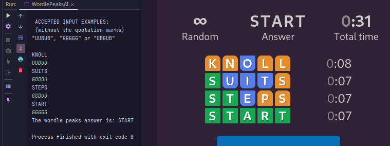

# WordlePeaks-AI
Simple Wordle Peaks Solver that can quickly solve Wordle Peaks puzzles. <br>
**THE BEST OPENER FOR WORDLE PEAKS IS `KNOLL`**

## Wordle Peaks
Wordle Peaks is a puzzling variant of Wordle in which the feedback given doesn't tell you whether its in the word or not, but instead, the feedback lets you know whether the letter is higher or lower than the input in terms of its position in the alphabet.

**EXAMPLE:** <br>


### Example Usage


----

### Statistics
- 100% win rate
- Instant calculating and guessing

### Symbols
- The orange square marks the symbol indicating that the letter in that position stands in a higher position in the alphabet than the given input character. (U)
- The blue square marks the symbol indicating that the letter in that position stands in a lower position in the alphabet than the given input character. (D)
- The green squares mean you found the correct letter in the correct position. (G)

### Rules
- Guess the 5 letter English Word using limited feedback as described as above.
- Make guesses and use the clues to make smarter guesses in the future.
- Win or lose if you can't guess the word in 6 tries maximum, you lose.

## Algorithms
Constructing a Binary Search with a minimum and maximum limit for each of the 5 characters and running them simultaneously. 
With the 5 different binary search algorithms in play, for each move, construct a string with the averages of the binary search limits for each of the 5 characters and compare it with every string. 
Calculate `diff` for each pair of strings, where `diff` can be defined as the sum of the absolute value of the differences in the corresponding pair of characters' ascii values from the pair of string `x` (from the word list) and the constructed average string that we want to guess. 
For that move guess the word from the pair with the least `diff` out of all pairs.

#### Calculating diff between 2 words:
```
K N O L L _
M M M M M
---------
2 1 2 1 1 =====> 2+1+2+1+1 = 7
```

### Time Complexity
Since all 5 binary searches are done simultaneously the time complexity of the algorithm can be simplified to `O(n*log(m))` where `n` is the number of words in the word list and `m` is the number of letters in the alphabet (26).

### Explanation
We perform binary search algorithms because it produces the correct answer in the least amount of guesses as possible and is relatively fast for runtime complexity. The feedback given by wordle peaks for every guess gives the perfect amount of information to be able to run a binary search algorithm to find the best average which will cut out the most amount of possibilities from the population such that we gain more information on average. We can't perform a binary search on the string as a whole because the characters have their own rankings so we HAVE to perform binary search for all characters in the string, which in this case is length 5. With the binary search in tact, we can calculate the string that would give us the most amount of information on average. However, that string might not be an English word in the English dictionary. So, we calculate the differences using ascii values for all values from an established set of 5 letter words in the English dictionary and select the word with the least difference from the calcualted average string from the 5 character binary searches and use that for our guess.

#### Example
The binary search for each character starts with the limits: `(0, 25)` *`0` indicating `A` (minimum) and `25` indicating `Z` (maximum)* <br>
So, the calculated average string would be: `MMMMM` <br>
However, this is not an English word! So, after iterating through a [large list of English words with 5 letters](https://www-cs-faculty.stanford.edu/~knuth/sgb-words.txt) and finding which word has the least `diff`, I found out that the best opening word for Wordle Peaks is `KNOLL` with only a `diff` value of 7.

----

*Created by BooleanCube :]*
